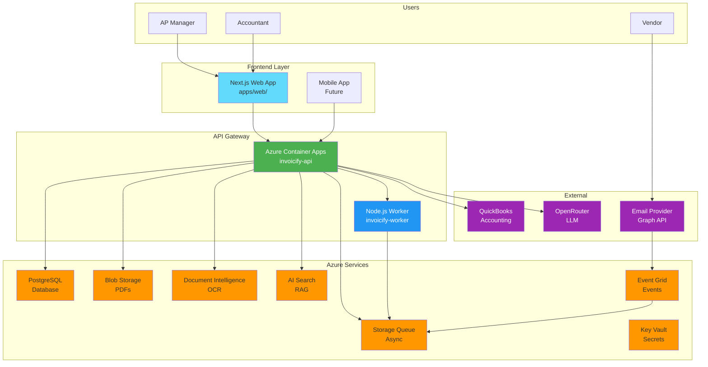
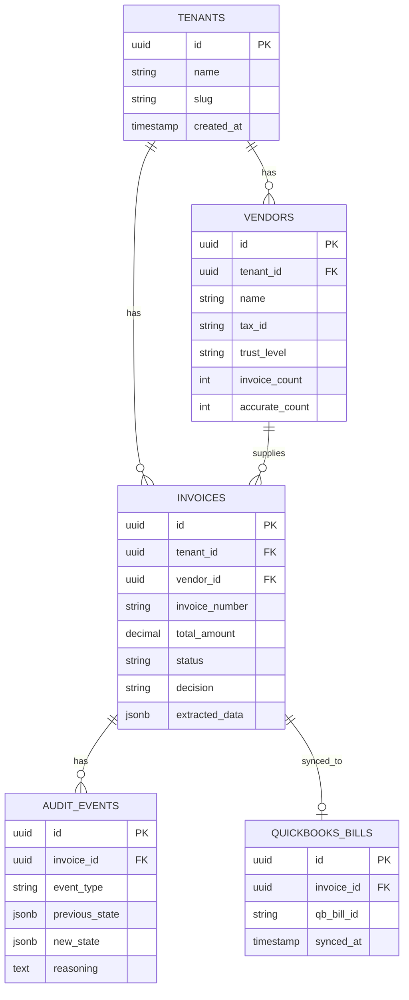

# INVOICIFY — SYSTEM ARCHITECTURE

**Version:** 4.0 (Azure-Native)  
**Last Updated:** March 1, 2026  
**Status:** ✅ Production-Ready  
**Branch:** `feat/azure-native-migration`

---

## 📖 TABLE OF CONTENTS

```
├── 1. ARCHITECTURE OVERVIEW
├── 2. MONOREPO STRUCTURE
├── 3. COMPONENT DESIGN
├── 4. DATA MODEL
├── 5. API DESIGN
├── 6. INFRASTRUCTURE
├── 7. SECURITY
├── 8. SCALABILITY
└── 9. MONITORING
```

---

## 1. ARCHITECTURE OVERVIEW

### 1.1 High-Level Architecture



### 1.2 Design Principles

| Principle | Implementation |
|-----------|---------------|
| **Serverless First** | Azure Container Apps (auto-scale to zero) |
| **Event-Driven** | Event Grid → Storage Queue → Worker |
| **Data Minimization** | Store hashes, not PDFs (SOC 2) |
| **Idempotency** | Request-Id headers (QuickBooks) |
| **Free Tier Optimized** | All services within free limits |
| **Security by Design** | Key Vault, Managed Identity, RBAC |

---

## 2. MONOREPO STRUCTURE

```
invoicify/
│
├── apps/
│   ├── agent-core/              # FastAPI Backend (Python 3.11)
│   │   ├── src/
│   │   │   ├── main.py          # Entry point (+ queue consumer)
│   │   │   ├── config.py        # Settings (Azure-compatible)
│   │   │   ├── extraction/
│   │   │   │   ├── sarvam_extractor.py  # Multi-mode OCR
│   │   │   │   └── azure_extractor.py   # Azure Doc Intelligence
│   │   │   ├── ingestion/
│   │   │   │   └── intake_router.py     # Rate limit + dedup
│   │   │   ├── queue/
│   │   │   │   └── azure_queue.py       # Storage Queue consumer
│   │   │   ├── cache/
│   │   │   │   └── trust_battery_cache.py  # L1/L2/L3 cache
│   │   │   ├── trust/
│   │   │   │   └── battery.py           # Trust level logic
│   │   │   ├── llm/
│   │   │   │   └── router.py            # Multi-provider LLM
│   │   │   ├── audit/
│   │   │   │   └── ledger.py            # Append-only events
│   │   │   └── execution/
│   │   │       └── quickbooks_sync.py   # Idempotent sync
│   │   ├── tests/
│   │   │   ├── tdd/             # 51 unit tests
│   │   │   └── e2e/             # Real service tests
│   │   ├── Dockerfile           # Multi-stage build
│   │   └── pyproject.toml       # Dependencies (uv)
│   │
│   ├── web/                     # Next.js Frontend (TypeScript)
│   │   ├── app/                 # App Router
│   │   ├── components/          # React components
│   │   ├── lib/                 # Utilities
│   │   └── package.json
│   │
│   ├── api/                     # Separate API Layer
│   ├── edge-api/                # Edge Routing
│   └── voice-agent/             # Sarvam Voice Integration
│
├── invoicify-worker/            # Node.js Worker (TypeScript)
│   ├── src/
│   │   ├── app.ts               # Hono app (shared)
│   │   ├── server.ts            # Node.js server (Azure)
│   │   ├── index.ts             # Cloudflare Worker entry
│   │   ├── routes/              # API routes
│   │   ├── lib/
│   │   │   ├── db-adapter.ts    # PostgreSQL adapter
│   │   │   └── r2-adapter.ts    # Azure Blob adapter
│   │   └── durable-objects/     # Durable Objects (Cloudflare)
│   ├── Dockerfile               # Azure Container App
│   └── package.json
│
├── infra/
│   └── main.bicep               # Azure Infrastructure (810 lines)
│
├── scripts/
│   ├── bootstrap.sh             # One-command Azure setup
│   ├── seed-keyvault.sh         # Key Vault seeding
│   ├── start_*.sh               # Local Docker startup
│   └── test-*.sh                # Test scripts
│
├── .github/
│   └── workflows/
│       └── azure-deploy.yml     # CI/CD pipeline
│
└── docs/
    ├── README.md                # Main documentation
    ├── DEPLOY.md                # Deployment guide
    ├── prd.md                   # Product requirements
    └── ARCHITECTURE.md          # This file
```

---

## 3. COMPONENT DESIGN

### 3.1 Agent Core (FastAPI)

```python
# apps/agent-core/src/main.py

from fastapi import FastAPI
from src.queue.azure_queue import AzureQueueConsumer

app = FastAPI(title="Invoicify Agent Core")

_queue_consumer: Optional[AzureQueueConsumer] = None

@app.on_event("startup")
async def startup_event():
    """Start Azure Storage Queue consumer."""
    global _queue_consumer
    _queue_consumer = AzureQueueConsumer(pipeline_fn=run_pipeline)
    asyncio.create_task(_queue_consumer.start())

@app.on_event("shutdown")
async def shutdown_event():
    """Graceful shutdown of queue consumer."""
    global _queue_consumer
    if _queue_consumer:
        await _queue_consumer.stop()

@app.post("/api/v1/invoices")
async def process_invoice(file: UploadFile, tenant_id: str):
    """Upload and process invoice."""
    # 1. Upload to Blob Storage
    # 2. Extract with Azure OCR
    # 3. Parse with LLM
    # 4. Check Trust Battery
    # 5. Make decision (AUTO/HITL/BLOCK)
    # 6. Queue async processing
```

### 3.2 Worker (Node.js)

```typescript
// invoicify-worker/src/server.ts

import { serve } from '@hono/node-server'
import { app } from './app'

const port = 8787
console.log(`Server started on http://localhost:${port}`)

serve({
  fetch: app.fetch,
  port
})

// invoicify-worker/src/app.ts
import { Hono } from 'hono'
import { cors } from 'hono/cors'

export const app = new Hono()

app.use('*', cors())

app.get('/health', (c) => {
  return c.json({ status: 'healthy', timestamp: new Date().toISOString() })
})

app.get('/api/v1', (c) => {
  return c.json({ version: '1.0.0', name: 'Invoicify Worker' })
})

// Mount routes
app.route('/api/v1/invoices', invoicesRoutes)
app.route('/api/v1/extract', extractRoutes)
// ... more routes
```

### 3.3 Queue Consumer

```python
# apps/agent-core/src/queue/azure_queue.py

from azure.storage.queue.aio import QueueClient

class AzureQueueConsumer:
    def __init__(self, pipeline_fn):
        self.pipeline_fn = pipeline_fn
        self.queue_client = QueueClient.from_connection_string(
            os.getenv("AZURE_STORAGE_CONNECTION_STRING"),
            "invoice-processing"
        )
    
    async def start(self):
        """Poll queue and process messages."""
        while self.running:
            messages = await self.queue_client.receive_messages(
                max_messages=10,
                visibility_timeout=300
            )
            async for message in messages:
                await self._process_message(message)
    
    async def _process_message(self, message):
        """Process single invoice message."""
        try:
            invoice_data = json.loads(message.content)
            await self.pipeline_fn(**invoice_data)
            await self.queue_client.delete_message(message)
        except Exception as e:
            logger.error(f"Processing failed: {e}")
            # Message becomes visible again after visibility_timeout
```

---

## 4. DATA MODEL

### 4.1 Database Schema (PostgreSQL)

```sql
-- Invoices table
CREATE TABLE invoices (
    id UUID PRIMARY KEY DEFAULT gen_random_uuid(),
    tenant_id UUID NOT NULL,
    vendor_id UUID REFERENCES vendors(id),
    invoice_number VARCHAR(100) NOT NULL,
    invoice_date DATE,
    due_date DATE,
    subtotal DECIMAL(10,2),
    tax_amount DECIMAL(10,2),
    total_amount DECIMAL(10,2),
    currency VARCHAR(3) DEFAULT 'INR',
    status VARCHAR(20) DEFAULT 'PENDING',
    trust_level VARCHAR(20),
    decision VARCHAR(20),
    quickbooks_id VARCHAR(100),
    blob_url TEXT,
    extracted_data JSONB,
    created_at TIMESTAMP DEFAULT NOW(),
    updated_at TIMESTAMP DEFAULT NOW()
);

-- Vendors table
CREATE TABLE vendors (
    id UUID PRIMARY KEY DEFAULT gen_random_uuid(),
    tenant_id UUID NOT NULL,
    name VARCHAR(255) NOT NULL,
    tax_id VARCHAR(50),
    email VARCHAR(255),
    trust_level VARCHAR(20) DEFAULT 'PROBATION',
    invoice_count INTEGER DEFAULT 0,
    accurate_count INTEGER DEFAULT 0,
    auto_approve_limit DECIMAL(10,2) DEFAULT 0,
    created_at TIMESTAMP DEFAULT NOW()
);

-- Audit events table (append-only)
CREATE TABLE audit_events (
    id UUID PRIMARY KEY DEFAULT gen_random_uuid(),
    invoice_id UUID REFERENCES invoices(id),
    event_type VARCHAR(50) NOT NULL,
    actor VARCHAR(50) NOT NULL,
    previous_state JSONB,
    new_state JSONB,
    reasoning TEXT,
    created_at TIMESTAMP DEFAULT NOW()
);

-- Indexes
CREATE INDEX idx_invoices_tenant ON invoices(tenant_id);
CREATE INDEX idx_invoices_status ON invoices(status);
CREATE INDEX idx_vendors_tenant ON vendors(tenant_id);
CREATE INDEX idx_audit_events_invoice ON audit_events(invoice_id);
```

### 4.2 Entity Relationship



---

## 5. API DESIGN

### 5.1 REST Endpoints

```yaml
openapi: 3.0.0
info:
  title: Invoicify API
  version: 1.0.0

paths:
  /api/v1/invoices:
    post:
      summary: Upload invoice
      requestBody:
        content:
          multipart/form-data:
            schema:
              type: object
              properties:
                file:
                  type: string
                  format: binary
                tenant_id:
                  type: string
      responses:
        200:
          description: Invoice uploaded
          content:
            application/json:
              schema:
                $ref: '#/components/schemas/InvoiceResponse'
    
    get:
      summary: List invoices
      parameters:
        - name: tenant_id
          in: query
          schema:
            type: string
        - name: status
          in: query
          schema:
            type: string
      responses:
        200:
          description: List of invoices
  
  /api/v1/invoices/{id}:
    get:
      summary: Get invoice details
      parameters:
        - name: id
          in: path
          required: true
          schema:
            type: string
      responses:
        200:
          description: Invoice details
  
  /api/v1/vendor-trust/{vendor_id}:
    get:
      summary: Get vendor trust level
      parameters:
        - name: vendor_id
          in: path
          required: true
          schema:
            type: string
      responses:
        200:
          description: Trust level info
```

### 5.2 Event Schema

```json
{
  "id": "evt_123456",
  "type": "invoice.uploaded",
  "source": "invoicify-api",
  "time": "2026-03-01T12:00:00Z",
  "data": {
    "invoice_id": "inv_789",
    "tenant_id": "tenant_456",
    "blob_url": "https://...",
    "file_name": "invoice.pdf"
  }
}
```

---

## 6. INFRASTRUCTURE

### 6.1 Azure Resources

```bicep
// infra/main.bicep (simplified)

param location string = 'eastus'
param appName string = 'invoicify'

// Container Registry
resource acr 'Microsoft.ContainerRegistry/registries@2023-07-01' = {
  name: '${appName}registry'
  location: location
  sku: {
    name: 'Standard'
  }
}

// PostgreSQL
resource postgres 'Microsoft.DBforPostgreSQL/flexibleServers@2023-06-01-preview' = {
  name: '${appName}-postgres'
  location: location
  sku: {
    name: 'Standard_B1ms'
    tier: 'Burstable'
  }
}

// Blob Storage
resource storage 'Microsoft.Storage/storageAccounts@2023-05-01' = {
  name: '${appName}store'
  location: location
  kind: 'StorageV2'
}

// Storage Queue
resource queue 'Microsoft.Storage/storageAccounts/queueServices/queues@2023-05-01' = {
  parent: storage
  name: 'invoice-processing'
}

// Container Apps Environment
resource containerEnv 'Microsoft.App/managedEnvironments@2024-03-01' = {
  name: '${appName}-env'
  location: location
}

// API Container App
resource apiApp 'Microsoft.App/containerApps@2024-03-01' = {
  name: '${appName}-api'
  properties: {
    managedEnvironmentId: containerEnv.id
    template: {
      containers: [
        {
          name: 'api'
          image: '${acr.properties.loginServer}/invoicify-api:latest'
        }
      ]
    }
  }
}

// Worker Container App
resource workerApp 'Microsoft.App/containerApps@2024-03-01' = {
  name: '${appName}-worker'
  properties: {
    managedEnvironmentId: containerEnv.id
    template: {
      containers: [
        {
          name: 'worker'
          image: '${acr.properties.loginServer}/invoicify-worker:latest'
          command: ['node', 'dist/server.js']
        }
      ]
    }
  }
}
```

### 6.2 CI/CD Pipeline

```yaml
# .github/workflows/azure-deploy.yml

name: Deploy Invoicify

on:
  push:
    branches: [feat/azure-native-migration, main]

jobs:
  test:
    runs-on: ubuntu-latest
    steps:
      - uses: actions/checkout@v4
      - run: uv run pytest tests/ -v
  
  deploy-infra:
    needs: test
    runs-on: ubuntu-latest
    if: contains(github.event.head_commit.modified, 'infra/')
    steps:
      - uses: azure/login@v2
      - uses: azure/arm-deploy@v2
        with:
          template: ./infra/main.bicep
  
  deploy-agent-core:
    needs: test
    runs-on: ubuntu-latest
    steps:
      - uses: azure/login@v2
      - run: az acr login --name invoicifyregistry
      - run: docker build -t invoicifyregistry.azurecr.io/agent-core:latest apps/agent-core/
      - run: docker push invoicifyregistry.azurecr.io/agent-core:latest
      - run: az containerapp update --name invoicify-api --image ...
  
  deploy-web:
    needs: test
    if: contains(github.event.head_commit.modified, 'apps/web/')
    uses: Azure/static-web-apps-deploy@v1
```

---

## 7. SECURITY

### 7.1 Secret Management

```
┌─────────────────────────────────────────────────────────────┐
│                    SECRET LAYERS                            │
├─────────────────────────────────────────────────────────────┤
│  GitHub Secrets    → CI/CD credentials (Azure, Docker)      │
│  Azure Key Vault   → Runtime secrets (DB, API keys)         │
│  Managed Identity  → Azure service auth (no credentials)    │
│  .gitignore        → Prevents accidental commits            │
│  Pre-commit hook   → Scans for secrets before commit        │
└─────────────────────────────────────────────────────────────┘
```

### 7.2 RBAC

```bicep
// Managed Identity → Key Vault
resource kvApiRole 'Microsoft.Authorization/roleAssignments@2022-04-01' = {
  scope: keyVault
  properties: {
    roleDefinitionId: '4633458b-17de-408a-b874-0445c86b69e6'  // Key Vault Secrets User
    principalId: apiApp.identity.principalId
  }
}

// Managed Identity → Blob Storage
resource storageRole 'Microsoft.Authorization/roleAssignments@2022-04-01' = {
  scope: storage
  properties: {
    roleDefinitionId: 'ba92f5b4-2d11-453d-a403-e96b0029c9fe'  // Storage Blob Data Contributor
    principalId: apiApp.identity.principalId
  }
}
```

### 7.3 Data Minimization

```python
# Instead of storing PDF (liability):
# Store SHA-256 hash (audit proof)

receipt = {
    "invoice_id": "INV-123",
    "quickbooks_id": "qb-456",
    "document_hash": "sha256:abc123...",  # Not the actual PDF
    "decision": "APPROVED",
    "timestamp": "2026-03-01T12:00:00Z"
}
```

---

## 8. SCALABILITY

### 8.1 Auto-Scaling

```yaml
# Container Apps scaling
scale:
  minReplicas: 0      # Scale to zero when idle
  maxReplicas: 5      # Max 5 replicas
  rules:
    - name: http-scale
      http:
        metadata:
          concurrentRequests: "100"  # Scale at 100 concurrent requests
    - name: queue-scale
      azure-servicebus:
        metadata:
          queueName: invoice-processing
          messageCount: "10"  # Scale at 10 messages
```

### 8.2 Caching Strategy

```
┌─────────────────────────────────────────────────────────────┐
│                   L1/L2/L3 CACHE                            │
├─────────────────────────────────────────────────────────────┤
│  L1: In-process dict (0ms)     → 5 min TTL                  │
│  L2: Azure Redis (1ms)         → 24 hr TTL (optional)       │
│  L3: PostgreSQL (10ms)         → Source of truth            │
│                                                             │
│  Hit Rate Target: 90% (L1 + L2)                             │
│  Cost Reduction: 90% fewer DB queries                       │
└─────────────────────────────────────────────────────────────┘
```

---

## 9. MONITORING

### 9.1 Azure Monitor

```bicep
// Log Analytics Workspace
resource logAnalytics 'Microsoft.OperationalInsights/workspaces@2022-10-01' = {
  name: '${appName}-logs'
  properties: {
    sku: { name: 'PerGB2018' }
    retentionInDays: 30
  }
}

// Container Apps → Log Analytics
resource containerEnv 'Microsoft.App/managedEnvironments@2024-03-01' = {
  properties: {
    appLogsConfiguration: {
      destination: 'log-analytics'
      logAnalyticsConfiguration: {
        customerId: logAnalytics.properties.customerId
        sharedKey: logAnalytics.listKeys().primarySharedKey
      }
    }
  }
}
```

### 9.2 Key Metrics

| Metric | Alert Threshold | Action |
|--------|----------------|--------|
| API Latency (p95) | >1000ms | Scale up |
| Error Rate | >1% | Page on-call |
| Queue Depth | >100 messages | Scale worker |
| OCR Accuracy | <95% | Manual audit |
| Cost/Day | >$5 | Review usage |

---

**Prepared by:** AI Development Team  
**Last Updated:** March 1, 2026  
**Next Review:** April 1, 2026
