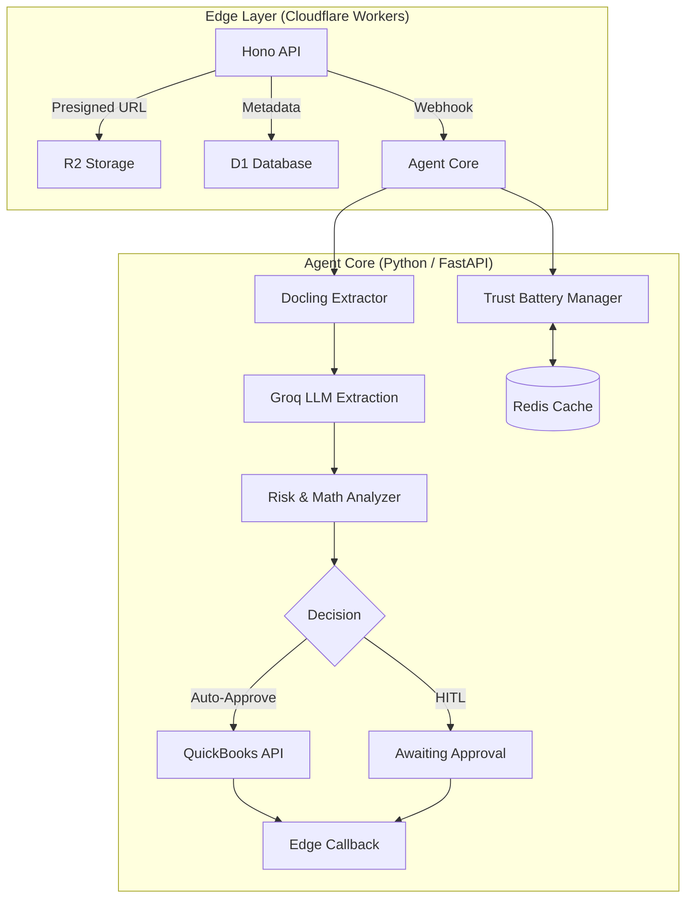

# Invoicify AI - Hybrid Agentic Finance Operations

**Invoicify** is a production-grade autonomous Accounts Payable (AP) agent that automates the complete invoice lifecycle: ingestion → extraction → risk assessment → decision → execution → audit.

Built with a **Hybrid Edge-Core Architecture** for maximum performance and cost-efficiency.

## 🚀 Key Performance Wins
- **Save 40-60% Latency**: Parallelized extraction and QuickBooks pre-sync.
- **Instant Hot-Reload**: Redis-backed Trust Battery caching for repeat vendors.
- **Sub-Second Extraction**: Optimized Docling parsing limited to critical pages (max 3).
- **Persistent Pooling**: Global HTTP connection pooling for all external API calls.

## 🏗️ Modern Hybrid Architecture



## 🛠️ Tech Stack

### Agent Core (Python)
- **FastAPI**: High-performance async API framework.
- **Docling**: Advanced document parsing to high-fidelity Markdown.
- **Groq LLM**: Ultra-fast structured extraction from Markdown.
- **Redis**: Persistent hot-cache for vendor trust states.
- **Tenacity**: Robust retry logic for external integrations.
- **Structlog**: Observable, machine-readable pipeline tracing.

### Edge API (TypeScript)
- **Hono**: Lightweight, edge-native routing.
- **D1**: Edge SQL database for metadata and persistence.
- **R2**: S3-compatible object storage for raw PDFs.
- **Better Auth**: Secure, edge-compatible authentication.

## 🔋 Trust Battery System
The system learns from every decision. Trust levels adjust dynamically based on historical accuracy:
- **PROBATION**: New vendors. 100% review required.
- **STANDARD**: 50+ accurate invoices. Auto-approve up to $500.
- **CORE**: 100+ accurate invoices. Auto-approve up to $5,000.

## 🏁 Quick Start

### 1. Environment Setup
Create `apps/agent-core/.env`:
```env
GROQ_API_KEY=gsk_...
EDGE_API_BASE_URL=http://localhost:8787
REDIS_URL=redis://localhost:6379
QUICKBOOKS_CLIENT_ID=...
QUICKBOOKS_CLIENT_SECRET=...
```

### 2. Run with Docker Compose
```bash
docker-compose up -d --build
```

### 3. Monitoring
Check real-time performance metrics in the logs:
```bash
docker logs -f invoicify-agent
# Look for: operation_timed duration_ms=4523.12
```

## 📦 Project Structure
- `apps/agent-core`: Python FastAPI service (The Brain).
- `apps/edge-api`: Cloudflare Workers service (The Gateway).
- `docs/`: Product and Architecture documentation.
- `scripts/`: Development and maintenance utilities.

---
Built with ❤️ by the Antigravity Team.
