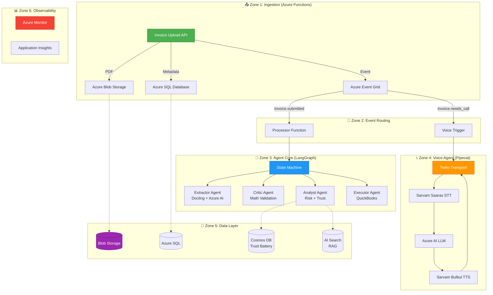
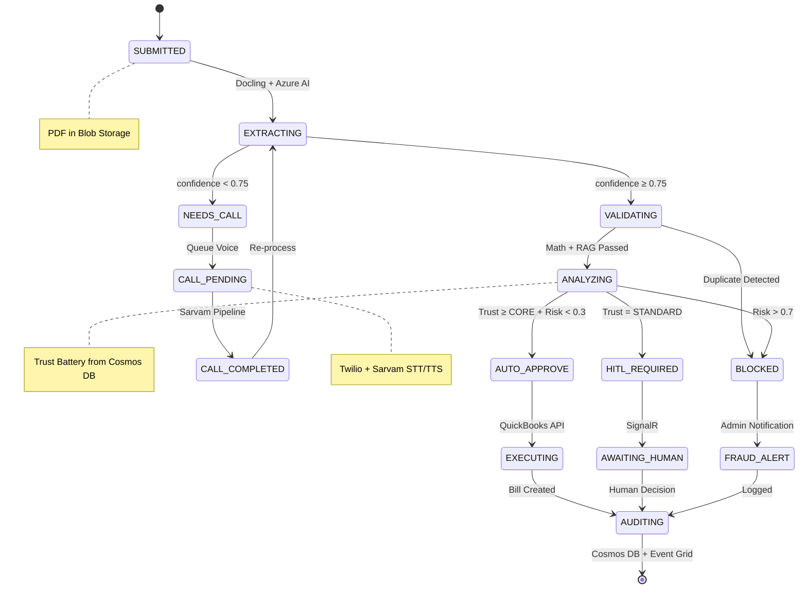
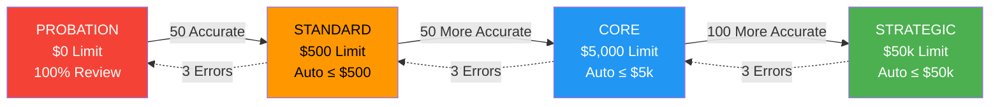

# INVOICIFY — Azure-Native Invoice Processing Agent

[](https://github.com/Aparnap2/invoicify)
[](https://github.com/Aparnap2/invoicify/tree/feat/azure-native-migration)
[](LICENSE)

**Invoicify** is an autonomous Accounts Payable (AP) agent that automates invoice processing end-to-end: ingestion → extraction → risk assessment → decision → execution → audit. Built on **100% Azure-native stack** with **Sarvam AI** for Indian language voice support.

---

## 🎯 Key Features

- **☁️ Azure-Native**: Full Azure ecosystem (Functions, Blob Storage, SQL, Cosmos DB, AI Foundry)
- **🇮🇳 Indian-First**: Sarvam Saaras STT + Bulbul TTS for Hindi/Gujarati/Marathi voice calls
- **🔋 Trust Battery**: Vendor trust scoring with automatic approval limits ($0 → $50,000)
- **📞 Voice RFP Calls**: Automated vendor calls for quote collection (Twilio + Sarvam)
- **🧪 TDD Verified**: 81+ unit tests + integration tests with real Docker containers
- **🔒 SOC 2 Ready**: Immutable audit logs, distributed tracing, Azure Key Vault

---

## 🏗️ Architecture Overview



---

## 🔄 Invoice Processing Pipeline



---

## 🔋 Trust Battery System



**Trust Score Formula:**
```
Trust Score = (0.6 × Accuracy) + (0.2 × Volume) + (0.2 × Recency)
```

---

## 🛠️ Tech Stack

| Layer | Technology | Purpose |
|-------|-----------|---------|
| **Edge API** | Azure Functions | Serverless ingestion API |
| **Storage** | Azure Blob Storage | PDF storage (SAS URLs) |
| **Database** | Azure SQL Database | Invoice metadata |
| **NoSQL** | Cosmos DB | Trust Battery + audit logs |
| **Search** | Azure AI Search | RAG for duplicate detection |
| **LLM** | Azure AI Foundry | GPT-4o for extraction |
| **Voice STT** | Sarvam Saaras v3 | Hindi/Gujarati/Marathi |
| **Voice TTS** | Sarvam Bulbul v3 | Indian voice synthesis |
| **Telephony** | Twilio | PSTN voice calls |
| **Orchestration** | LangGraph | State machine pipeline |
| **Parsing** | IBM Docling | PDF → Markdown |

---

## 🚀 Quick Start

### Prerequisites

```bash
# Docker for local emulators
docker --version

# Azure CLI for deployment
az --version

# Python 3.11+ with uv
uv --version
```

### 1. Clone & Setup

```bash
git clone https://github.com/Aparnap2/invoicify.git
cd invoicify
git checkout feat/azure-native-migration
```

### 2. Start Local Azure Emulators

```bash
# Start containers individually (preserves your Ollama models)
docker run -d --name invoicify-azurite -p 10000:10000 \
  mcr.microsoft.com/azure-storage/azurite:latest \
  azurite --blobHost 0.0.0.0 --loose

docker run -d --name invoicify-azure-sql -p 1433:1433 \
  -e ACCEPT_EULA=Y -e MSSQL_SA_PASSWORD=Invoicify@Local123 \
  mcr.microsoft.com/mssql/server:2022-latest

docker run -d --name invoicify-cosmos -p 8081:8081 \
  -e AZURE_COSMOS_EMULATOR_PARTITION_COUNT=3 \
  mcr.microsoft.com/cosmosdb/linux/azure-cosmos-emulator:latest

# Start your existing Ollama (preserves models)
docker start ollama
```

### 3. Configure Environment

```bash
# Copy example config
cp apps/agent-core/.env.example apps/agent-core/.env.local

# Edit with your Azure credentials
# Required for LLM tests:
export AZURE_OPENAI_API_KEY="your-key"
export AZURE_OPENAI_ENDPOINT="https://your-resource.openai.azure.com/"
export AZURE_OPENAI_DEPLOYMENT="gpt-4o"

# Optional for voice tests:
export SARVAM_API_KEY="your-sarvam-key"
```

### 4. Install Dependencies

```bash
cd apps/agent-core
uv sync
```

### 5. Run Tests

```bash
# Unit tests (81 tests, fast)
uv run pytest tests/unit/ -v

# Integration tests (requires Docker containers)
uv run pytest tests/tdd/test_azure_integration.py -v -s

# Verify Azure stack
./scripts/verify_azure_stack.sh
```

### 6. Run Agent Core

```bash
uv run uvicorn src.main:app --reload --port 8000
```

---

## 📊 Test Results

| Test Type | Count | Status | Coverage |
|-----------|-------|--------|----------|
| **Unit Tests** | 81 | ✅ Passing | Schemas, Trust Battery, Pipeline |
| **Integration** | 8 | ⏳ Created | Azurite, Azure SQL, Cosmos DB |
| **E2E** | 8 | ⏳ Created | Full invoice flow |
| **LLM Eval** | 6 | ⏳ Created | Extraction quality |

**Run all tests:**
```bash
uv run pytest tests/ -v --tb=short
```

---

## 📁 Project Structure

```
invoicify/
├── apps/
│   ├── agent-core/              # Python FastAPI backend
│   │   ├── src/
│   │   │   ├── schemas/         # Pydantic v2 models
│   │   │   ├── agents/          # Extractor, Critic, Analyst, Executor
│   │   │   ├── pipeline/        # LangGraph state machine
│   │   │   ├── trust/           # Trust Battery system
│   │   │   └── observability/   # Azure Monitor integration
│   │   └── tests/
│   │       ├── unit/            # 81 unit tests
│   │       ├── e2e/             # End-to-end tests
│   │       └── eval/            # LLM evaluation
│   │
│   ├── voice-agent/             # Sarvam voice pipeline
│   │   ├── src/
│   │   │   └── services/        # Service factory (Sarvam-only)
│   │   └── tests/
│   │
│   └── api/                     # Azure Functions (new)
│       ├── functions/           # HTTP triggers
│       ├── db/                  # Azure SQL client
│       └── storage/             # Azure Blob client
│
├── docker/
│   └── open-sarika/             # Local STT (deprecated)
│
├── tests/
│   ├── tdd/                     # TDD integration tests
│   └── integration/             # Azure-native tests
│
├── scripts/
│   ├── verify_azure_stack.sh    # Container verification
│   └── azure_sql_schema.sql     # Database schema
│
├── docker-compose.local.yml     # Azure emulators
└── prd.md                       # Product requirements
```

---

## 🧪 Testing with Real Containers

### Verification Script

```bash
# Verify all containers are running
./scripts/verify_azure_stack.sh

# Expected output:
# ✅ Azurite is running and responding
# ✅ Azure SQL is running and accepting connections
# ✅ Cosmos DB Emulator is running
# ✅ Ollama is running with 7 models
```

### TDD Tests

```bash
# Run TDD tests with real Docker + real Azure AI
export AZURE_OPENAI_API_KEY=...
export AZURE_OPENAI_ENDPOINT=...

uv run pytest tests/tdd/test_azure_integration.py -v -s

# Tests:
# - Azure Blob Storage TDD (Azurite)
# - Azure SQL TDD (SQL Server)
# - Azure AI LLM TDD (Azure OpenAI)
# - End-to-End invoice flow
```

---

## 💰 Cost Estimate

| Service | Free Tier | Monthly Cost (100k invoices) |
|---------|-----------|------------------------------|
| Azure Functions | 1M requests | $0 |
| Blob Storage | 5GB (12mo) | $1.84 |
| Azure SQL | 32GB always free | $0 |
| Cosmos DB | 25GB + 1k RU/s | $25 |
| Azure AI Foundry | $200 credit | $50 (after credit) |
| Sarvam AI | ₹1,000 credits | $12 |
| **Total** | | **~$90/month** |

---

## 📚 Documentation

| Document | Description |
|----------|-------------|
| **[PRD](prd.md)** | Product requirements + architecture |
| **[README](README.md)** | This file - quick start + overview |
| **[Azure Migration](AZURE_MIGRATION_SUMMARY.md)** | Cloudflare → Azure guide |
| **[Implementation](FINAL_IMPLEMENTATION_SUMMARY.md)** | Complete implementation details |
| **[TDD Tests](tests/tdd/test_azure_integration.py)** | Integration test suite |

---

## 🤝 Contributing

1. Fork the repository
2. Create a feature branch (`git checkout -b feat/amazing-feature`)
3. Commit your changes (`git commit -m 'Add amazing feature'`)
4. Push to the branch (`git push origin feat/amazing-feature`)
5. Open a Pull Request

**Branch:** `feat/azure-native-migration` (current development)

---

## 📄 License

This project is licensed under the MIT License - see the [LICENSE](LICENSE) file for details.

---

## 🙏 Acknowledgments

- **IBM Docling** - PDF parsing library
- **Sarvam AI** - Indian language STT/TTS
- **LangGraph** - State machine orchestration
- **Azure AI Foundry** - LLM platform
- **Twilio** - Voice telephony

---

**Built with ❤️ by the Invoicify Team**  
**Last Updated:** February 21, 2026  
**Version:** 3.0 (Azure-Native + Sarvam Voice)
