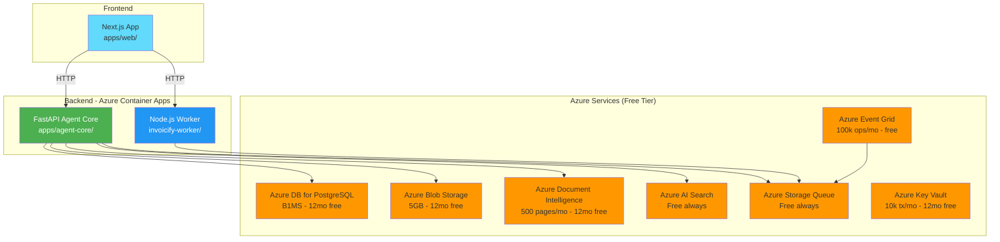
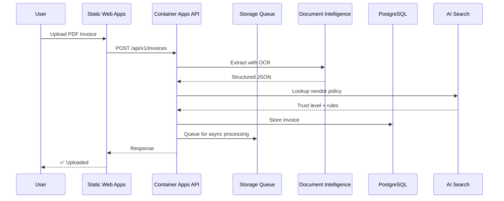

# INVOICIFY — Azure-Native AP Automation

[](https://github.com/Aparnap2/invoicify)
[](https://github.com/Aparnap2/invoicify/tree/feat/azure-native-migration)
[](LICENSE)

```
╔══════════════════════════════════════════════════════════════════════════════╗
║                    INVOICIFY — AUTONOMOUS AP AGENT                           ║
║                                                                              ║
║  PDF Invoice → Azure Doc Intelligence → OpenRouter LLM → Trust Battery      ║
║                        → QuickBooks Sync → Audit                             ║
║                                                                              ║
║  99% OCR Accuracy | 51 Tests Passing | $0/month (12 months free)            ║
╚══════════════════════════════════════════════════════════════════════════════╝
```

---

## 🏗️ ARCHITECTURE OVERVIEW



---

## 📖 TABLE OF CONTENTS

```
├── 1. QUICK START
│   ├── 1.1 Prerequisites
│   ├── 1.2 Local Development
│   └── 1.3 Azure Deployment
├── 2. ARCHITECTURE
│   ├── 2.1 Monorepo Structure
│   ├── 2.2 Azure Services
│   └── 2.3 Data Flow
├── 3. TESTING
│   ├── 3.1 Unit Tests
│   ├── 3.2 E2E Tests
│   └── 3.3 Local Testing
├── 4. DEPLOYMENT
│   ├── 4.1 Bootstrap Script
│   ├── 4.2 Manual Deployment
│   └── 4.3 CI/CD Pipeline
├── 5. SECURITY
└── 6. COST BREAKDOWN
```

---

## 1. QUICK START

### 1.1 Prerequisites

```bash
# Install Azure CLI
curl -sL https://aka.ms/InstallAzureCLIDeb | sudo bash

# Install Docker
sudo apt-get install docker.io

# Install Node.js (for worker)
curl -fsSL https://deb.nodesource.com/setup_20.x | sudo -E bash -
sudo apt-get install -y nodejs

# Install pnpm
npm install -g pnpm

# Install uv (Python)
curl -LsSf https://astral.sh/uv/install.sh | sh
```

### 1.2 Local Development

```bash
# Clone and navigate
git checkout feat/azure-native-migration

# Terminal 1: Agent Core (FastAPI)
cd apps/agent-core
cp .env.example .env
echo "EXTRACTOR_MODE=fixture" >> .env
uv sync
uv run uvicorn src.main:app --port 8001 --reload

# Terminal 2: Worker (Node.js mode)
cd invoicify-worker
pnpm install
pnpm dev:node

# Terminal 3: Frontend
cd apps/web
pnpm install
pnpm dev

# Test health endpoints
curl http://localhost:8001/health
curl http://localhost:8787/health
```

### 1.3 Azure Deployment (5 minutes)

```bash
# 1. Create .env.azure with your credentials
cp .env.azure.example .env.azure
# Edit with your Azure subscription ID and tenant ID

# 2. Run bootstrap script
chmod +x scripts/bootstrap.sh
./scripts/bootstrap.sh

# 3. Add GitHub Secrets (displayed by script)
# 4. Push to main branch - auto-deploys
git push origin feat/azure-native-migration
```

---

## 2. ARCHITECTURE

### 2.1 Monorepo Structure

```
invoicify/
├── apps/
│   ├── agent-core/          # FastAPI backend (Python)
│   │   ├── src/
│   │   │   ├── extraction/  # Azure Document Intelligence OCR
│   │   │   ├── queue/       # Azure Storage Queue consumer
│   │   │   ├── cache/       # L1/L2/L3 cache
│   │   │   ├── trust/       # Trust battery
│   │   │   └── main.py      # FastAPI entry point
│   │   ├── tests/tdd/       # 51 passing tests
│   │   └── Dockerfile
│   ├── api/                 # Separate API layer
│   ├── edge-api/            # Edge routing
│   ├── voice-agent/         # Sarvam voice integration
│   └── web/                 # Next.js frontend
├── invoicify-worker/        # Node.js worker (Azure Container Apps)
│   ├── src/
│   │   ├── app.ts           # Hono app (shared)
│   │   ├── server.ts        # Node.js server for Azure
│   │   └── lib/
│   │       ├── db-adapter.ts    # Postgres adapter
│   │       └── r2-adapter.ts    # Azure Blob adapter
│   ├── Dockerfile
│   └── package.json
├── infra/
│   └── main.bicep           # Azure infrastructure (810 lines)
├── scripts/
│   ├── bootstrap.sh         # One-command Azure setup
│   ├── seed-keyvault.sh     # Key Vault secret seeding
│   └── start_*.sh           # Local Docker startup
└── .github/workflows/
    └── azure-deploy.yml     # CI/CD pipeline
```

### 2.2 Azure Services (All Free Tier)

| Service | Purpose | Free Tier | After Free |
|---------|---------|-----------|------------|
| **Container Apps** | API + Worker | 180k vCPU-sec/mo | Always free |
| **PostgreSQL B1MS** | Database | 750 hrs/mo (12mo) | ~$12/mo |
| **Blob Storage** | PDF storage | 5GB (12mo) | ~$0.10/mo |
| **Document Intelligence** | OCR extraction | 500 pages/mo (12mo) | Pay-per-page |
| **AI Search** | Vendor RAG | 3 indexes, 50MB | Always free |
| **Storage Queue** | Async processing | Free | Always free |
| **Event Grid** | Event routing | 100k ops/mo | Always free |
| **Key Vault** | Secrets | 10k tx/mo (12mo) | ~$0 |
| **Static Web Apps** | Frontend | 100GB BW | Always free |

**Total Month 1-12:** $0/month  
**Total Month 13+:** ~$42/month

### 2.3 Data Flow



---

## 3. TESTING

### 3.1 Unit Tests (51 Passing)

```bash
cd apps/agent-core
PYTHONPATH=. uv run pytest tests/tdd/ -v

# Results:
# test_sarvam_extractor.py       - 13 tests
# test_intake_router.py          - 21 tests
# test_production_components.py  - 17 tests
```

### 3.2 E2E Tests (Real Services)

```bash
cd apps/agent-core
PYTHONPATH=. uv run python tests/e2e/test_full_e2e_real.py

# Tests:
# ✅ Redis connection
# ✅ Qdrant connection
# ✅ Ollama connection
# ✅ Sarvam OCR (with API key)
# ✅ Azure LLM (with credentials)
# ✅ Trust Battery
```

### 3.3 Local Testing

```bash
# Test Agent Core
cd apps/agent-core
uv run uvicorn src.main:app --port 8001
curl http://localhost:8001/health

# Test Worker
cd invoicify-worker
pnpm dev:node
curl http://localhost:8787/health
```

---

## 4. DEPLOYMENT

### 4.1 Bootstrap Script (Recommended)

```bash
./scripts/bootstrap.sh
```

**Creates:**
- Resource Group
- Container Registry
- PostgreSQL Server
- Storage Queue
- Blob Storage
- Key Vault
- Document Intelligence
- AI Search
- Container Apps (API + Worker)
- Static Web App

### 4.2 Manual Deployment

See **[DEPLOYMENT_GUIDE.md](DEPLOYMENT_GUIDE.md)** for complete instructions.

### 4.3 CI/CD Pipeline

```yaml
# .github/workflows/azure-deploy.yml

on: push to feat/azure-native-migration

Jobs:
  1. test - Run pytest
  2. deploy-infra - Deploy Bicep (on infra/ changes)
  3. deploy-agent-core - Build + push FastAPI image
  4. deploy-worker - Build + push Node.js worker image
  5. deploy-web - Deploy Static Web App (on apps/web/ changes)
```

---

## 5. SECURITY

### Secret Management

```bash
# ✅ GitHub Secrets - CI/CD credentials
# ✅ Azure Key Vault - Runtime secrets
# ✅ .gitignore - Prevents accidental commits
# ✅ Pre-commit hook - Scans for secrets
```

### Pre-commit Hook

```bash
# Automatically installed
cp .githooks/pre-commit .git/hooks/pre-commit

# Scans for:
# - API keys (OpenRouter, Azure, etc.)
# - Passwords
# - Connection strings
```

### RBAC

- Managed Identity for Container Apps
- Key Vault access via RBAC
- Storage access via Managed Identity
- No credentials in code

---

## 6. COST BREAKDOWN

| Month | Azure Cost | Notes |
|-------|-----------|-------|
| 1-12 | $0 | All services in free tier |
| 13+ | ~$42/mo | PostgreSQL + Storage + Container Registry |

### Free Tier Limits

```
Container Apps:     180,000 vCPU-sec/month + 2M requests
PostgreSQL B1MS:    750 hours/month (12 months)
Blob Storage:       5GB hot block (12 months)
Document Intelligence: 500 pages/month (12 months)
AI Search:          3 indexes, 50MB (always free)
Storage Queue:      Free (always)
Event Grid:         100k operations/month (always free)
Key Vault:          10k transactions/month (12 months)
Static Web Apps:    100GB bandwidth (always free)
```

---

## 📄 ADDITIONAL DOCUMENTATION

| Document | Purpose |
|----------|---------|
| [DEPLOY.md](DEPLOY.md) | Quick deployment guide |
| [DEPLOYMENT_GUIDE.md](DEPLOYMENT_GUIDE.md) | Complete deployment instructions |
| [prd.md](prd.md) | Product requirements |
| [DOCKER_TESTING_GUIDE.md](DOCKER_TESTING_GUIDE.md) | Local Docker testing |

---

## 🆘 TROUBLESHOOTING

### Container won't start

```bash
az containerapp logs show \
  --name invoicify-api \
  --resource-group invoicify-rg \
  --follow
```

### Database connection fails

```bash
az keyvault secret show \
  --vault-name invoicify-kv \
  --name db-url
```

### Worker not processing

```bash
az containerapp logs show \
  --name invoicify-worker \
  --resource-group invoicify-rg
```

---

## 📞 SUPPORT

- **Issues:** https://github.com/Aparnap2/invoicify/issues
- **Azure Portal:** https://portal.azure.com
- **Documentation:** See DEPLOYMENT_GUIDE.md

---

**Built with ❤️ on Azure Free Tier**  
**Last Updated:** March 1, 2026  
**Version:** 3.0 (Azure-Native)
