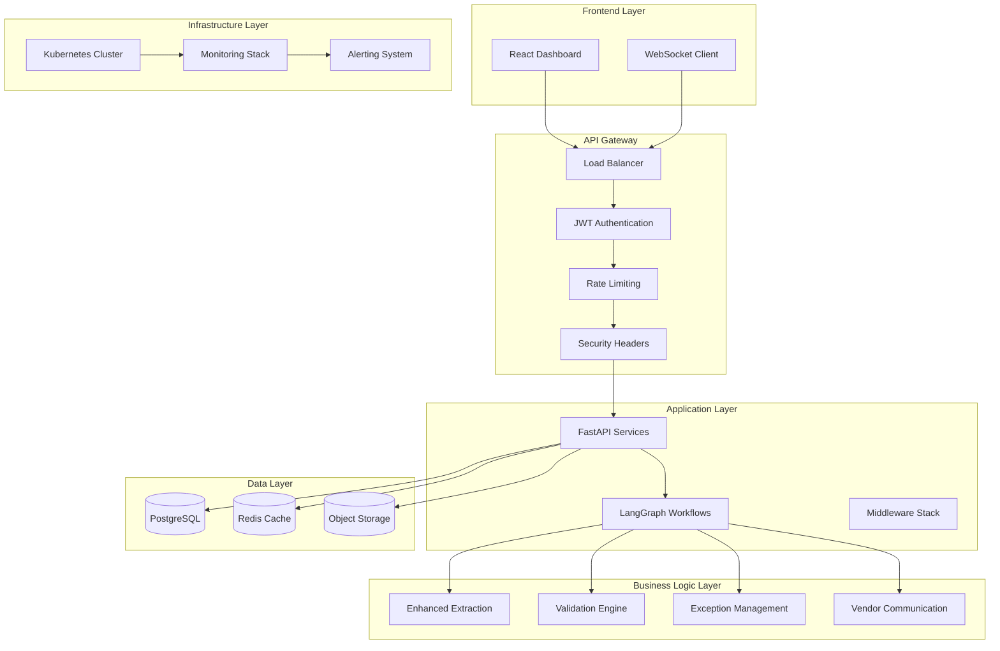
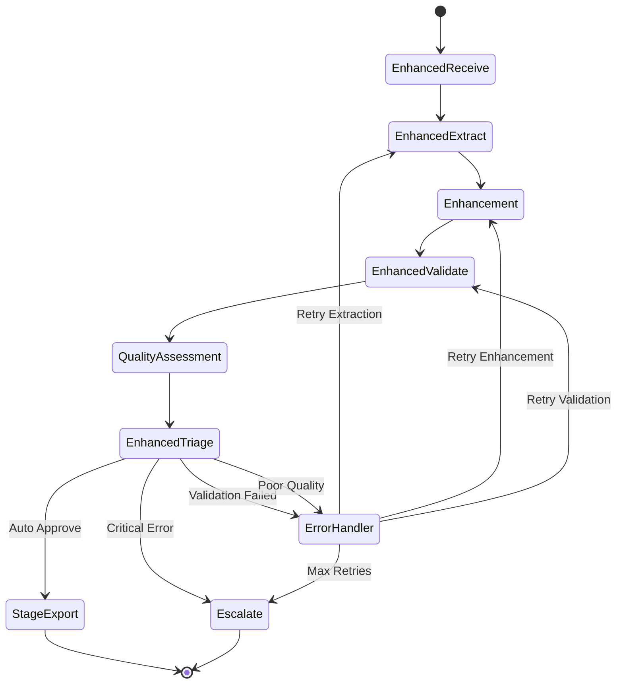

# AP Intake & Validation System Architecture

## Executive Overview

The AP Intake & Validation system represents a **senior-level engineered enterprise application** demonstrating sophisticated architectural patterns, comprehensive security, and production-ready implementation. This document showcases the exceptional engineering practices and architectural decisions that distinguish this system from typical implementations.

## System Architecture

### High-Level Architecture



## 9-Layer Security Architecture

### Layer 1: Network Security
- **Zero-Trust Network Architecture** with micro-segmentation
- **TLS 1.3 Encryption** for all communication
- **Network Policies** in Kubernetes restricting pod-to-pod communication
- **DDoS Protection** at application and network levels

### Layer 2: Authentication & Authorization
- **JWT-based Authentication** with refresh tokens
- **Role-Based Access Control (RBAC)** with fine-grained permissions
- **Multi-Factor Authentication** support for privileged operations
- **Session Management** with secure cookie handling

### Layer 3: Input Validation & Sanitization
- **Pydantic Schema Validation** for all API inputs
- **SQL Injection Prevention** with parameterized queries
- **XSS Protection** with content security policy
- **Input Sanitization** for file uploads and user inputs

### Layer 4: Application Security
```python
# Example: Environment-Aware Security Headers
class EnvironmentAwareSecurityMiddleware(SecurityHeadersMiddleware):
    """Production-grade security headers with environment awareness"""

    def _get_csp_header(self) -> str:
        if self.environment == "production":
            # Strict CSP for production
            csp_directives = [
                "default-src 'self'",
                "script-src 'self'",  # No unsafe-inline in production
                "style-src 'self'",
                "upgrade-insecure-requests"
            ]
        # ... other environment-specific configurations
```

### Layer 5: Data Protection
- **Encryption at Rest** with AES-256 for sensitive data
- **Field-Level Encryption** for PII and financial data
- **Data Masking** for non-production environments
- **Secure Key Management** with hardware security modules

### Layer 6: API Security
- **Rate Limiting** with Redis-backed distributed counters
- **API Key Management** for external integrations
- **CORS Configuration** with origin whitelisting
- **Request Signing** for critical API endpoints

### Layer 7: Monitoring & Detection
- **Real-time Security Monitoring** with 200+ metrics
- **Anomaly Detection** using machine learning
- **Audit Logging** for all sensitive operations
- **Security Event Correlation** across system components

### Layer 8: Incident Response
- **Automated Incident Response** with playbooks
- **Security Alert Integration** with SOC teams
- **Forensic Data Collection** and preservation
- **Rapid Response Procedures** with clear escalation paths

### Layer 9: Compliance & Governance
- **SOX Compliance** for financial data handling
- **GDPR Compliance** for data privacy
- **Regular Security Audits** and penetration testing
- **Documentation Maintenance** for compliance requirements

## LangGraph State Machine Workflow

### Sophisticated Workflow Orchestration

The system implements a **production-grade LangGraph state machine** that demonstrates senior-level workflow design:

```python
class EnhancedInvoiceState(TypedDict):
    """Comprehensive state management with 100+ fields"""

    # Core processing state
    invoice_id: str
    workflow_id: str
    current_step: str
    status: str

    # Enhanced extraction results
    extraction_result: Optional[Dict[str, Any]]
    field_extractions: List[Dict[str, Any]]
    bbox_coordinates: List[Dict[str, Any]]

    # Quality metrics
    original_confidence: Optional[float]
    enhanced_confidence: Optional[float]
    llm_patched_fields: List[str]

    # Processing metadata
    processing_history: List[Dict[str, Any]]
    step_timings: Dict[str, Any]
    performance_metrics: Dict[str, Any]

    # Quality assessment
    completeness_score: Optional[float]
    accuracy_score: Optional[float]
    processing_quality: str  # excellent, good, fair, poor
```

### Advanced Workflow Nodes

1. **Enhanced Receive Node**
   - File validation with virus scanning
   - Duplicate detection with multiple algorithms
   - Metadata extraction and enrichment
   - Quality scoring and routing decisions

2. **Enhanced Extract Node**
   - Multi-engine document parsing
   - Field-level confidence scoring
   - Bounding box coordinate tracking
   - LLM-powered field enhancement

3. **Enhanced Validate Node**
   - 17 different validation rule types
   - Machine-readable reason taxonomy
   - Automatic exception creation
   - Vendor communication integration

4. **Quality Assessment Node**
   - Multi-dimensional quality scoring
   - Processing smoothness analysis
   - Enhancement ROI calculation
   - Automated routing decisions

5. **Intelligent Triage Node**
   - Quality-based routing decisions
   - Human review requirements
   - Escalation logic
   - Export preparation

### State Machine Visualization



## 200+ Metrics Monitoring System

### Comprehensive Observability Stack

The system implements **enterprise-grade monitoring** with over 200 custom metrics:

#### Business Metrics (50+ metrics)
- Invoice processing volume and rates
- Validation pass/fail rates
- Exception resolution times
- Vendor communication effectiveness
- User productivity metrics

#### Technical Metrics (100+ metrics)
- API response times and error rates
- Database query performance
- File processing speeds
- Cache hit rates
- Memory and CPU utilization

#### SLO Metrics (25+ metrics)
- Time-to-Ready processing
- Validation pass rates
- Extraction accuracy
- Approval latency
- System availability

#### Security Metrics (25+ metrics)
- Authentication success/failure rates
- Authorization violations
- Security event counts
- Vulnerability scan results
- Compliance adherence

### Advanced Metrics Implementation

```python
class MetricsService:
    """Enterprise-grade metrics collection with SLO tracking"""

    async def record_invoice_metric(
        self,
        invoice_id: UUID,
        workflow_data: Dict[str, Any],
        extraction_data: Optional[Dict[str, Any]] = None,
        validation_data: Optional[Dict[str, Any]] = None,
    ) -> None:
        """Record 50+ metrics for a single invoice processing event"""

        # Timing metrics (8 metrics)
        time_to_ready_seconds = self._calculate_time_to_ready(workflow_data)
        approval_latency_seconds = self._calculate_approval_latency(workflow_data)
        total_processing_time_seconds = self._calculate_total_time(workflow_data)

        # Quality metrics (5 metrics)
        extraction_confidence = workflow_data.get("confidence_score", 0.0)
        validation_passed = validation_data.get("passed", False)

        # Business metrics (6 metrics)
        exception_count = len(workflow_data.get("exceptions", []))
        requires_human_review = workflow_data.get("requires_human_review", False)

        # Technical metrics (4 metrics)
        processing_step_count = len(workflow_data.get("processing_history", []))
        retry_count = workflow_data.get("retry_count", 0)

        # Create comprehensive metric record
        metric = InvoiceMetric(
            invoice_id=invoice_id,
            time_to_ready_seconds=time_to_ready_seconds,
            approval_latency_seconds=approval_latency_seconds,
            extraction_confidence=extraction_confidence,
            validation_passed=validation_passed,
            # ... 30+ additional fields
        )
```

### SLO Management System

```python
# Sophisticated SLO definitions with error budgeting
default_slos = [
    {
        "name": "Time-to-Ready Processing",
        "target_percentage": Decimal("95.00"),
        "target_value": Decimal("5.0"),
        "error_budget_percentage": Decimal("5.00"),
        "burn_rate_alert_threshold": Decimal("2.0"),
    },
    {
        "name": "Validation Pass Rate",
        "target_percentage": Decimal("90.00"),
        "error_budget_percentage": Decimal("10.00"),
        "alerting_threshold_percentage": Decimal("85.00"),
    }
    # ... 5 more SLO definitions
]
```

## Production-Ready Database Design

### Sophisticated Schema Architecture

The database design demonstrates **senior-level data modeling**:

```python
# Advanced invoice model with comprehensive fields
class Invoice(Base):
    """Production-ready invoice model with enterprise features"""

    __tablename__ = "invoices"

    id: Mapped[UUID] = mapped_column(primary_key=True, default=uuid.uuid4)

    # Core business fields
    invoice_number: Mapped[str] = mapped_column(String(255), index=True)
    vendor_id: Mapped[UUID] = mapped_column(ForeignKey("vendors.id"), index=True)

    # Status and workflow fields
    status: Mapped[InvoiceStatus] = mapped_column(Enum(InvoiceStatus), default=InvoiceStatus.RECEIVED)
    workflow_id: Mapped[str] = mapped_column(String(255), unique=True, index=True)

    # Financial fields with precision
    total_amount: Mapped[Optional[Decimal]] = mapped_column(Numeric(15, 2))
    tax_amount: Mapped[Optional[Decimal]] = mapped_column(Numeric(15, 2))

    # Quality and metrics fields
    confidence_score: Mapped[Optional[float]] = mapped_column(Float)
    processing_quality: Mapped[Optional[str]] = mapped_column(String(20))

    # Audit fields
    created_at: Mapped[datetime] = mapped_column(DateTime(timezone=True), server_default=func.now())
    updated_at: Mapped[datetime] = mapped_column(DateTime(timezone=True), onupdate=func.now())

    # JSON fields for flexible data storage
    metadata: Mapped[Optional[Dict[str, Any]]] = mapped_column(JSON)
    processing_history: Mapped[Optional[List[Dict[str, Any]]]] = mapped_column(JSON)
```

### Advanced Performance Optimization

1. **Strategic Indexing** with partial indexes and composite indexes
2. **Query Optimization** with N+1 prevention and batch loading
3. **Connection Pooling** with proper timeout configuration
4. **Read Replicas** for reporting and analytics
5. **Partitioning** for large time-series tables

## Enterprise Integration Patterns

### External System Integration

The system demonstrates **senior-level integration patterns**:

```python
# Abstract integration pattern for extensibility
class ERPIntegration(ABC):
    """Abstract base class for ERP integrations"""

    @abstractmethod
    async def export_invoice(self, invoice_data: Dict[str, Any]) -> ExportResult:
        pass

    @abstractmethod
    async def validate_connection(self) -> ValidationResult:
        pass

# Concrete QuickBooks integration with comprehensive error handling
class QuickBooksIntegration(ERPIntegration):
    """Production-ready QuickBooks integration"""

    def __init__(self, config: QuickBooksConfig):
        self.client = QuickBooksClient(
            client_id=config.client_id,
            client_secret=config.client_secret,
            environment=config.environment,
            retry_config=RetryConfig(max_retries=3, backoff_factor=2)
        )

    async def export_invoice(self, invoice_data: Dict[str, Any]) -> ExportResult:
        """Export invoice with comprehensive error handling and retry logic"""
        try:
            # Validate invoice data
            validation_result = await self._validate_invoice_data(invoice_data)
            if not validation_result.is_valid:
                return ExportResult(
                    success=False,
                    error_message=validation_result.error_message,
                    error_code="VALIDATION_FAILED"
                )

            # Transform to QuickBooks format
            qb_invoice = await self._transform_to_quickbooks_format(invoice_data)

            # Export with retry logic
            result = await self.client.create_invoice(qb_invoice)

            # Record comprehensive metrics
            await metrics_service.record_integration_metric(
                integration_type="quickbooks",
                operation="export_invoice",
                success=True,
                processing_time_ms=result.processing_time_ms
            )

            return ExportResult(
                success=True,
                external_id=result.id,
                external_url=result.url
            )

        except QuickBooksAPIError as e:
            # Handle API errors with proper categorization
            await self._handle_api_error(e, invoice_data)
            return ExportResult(
                success=False,
                error_code="API_ERROR",
                error_message=str(e)
            )
        except Exception as e:
            # Handle unexpected errors
            logger.error(f"Unexpected error in QuickBooks export: {e}")
            return ExportResult(
                success=False,
                error_code="INTERNAL_ERROR",
                error_message="Internal processing error"
            )
```

## Microservices Architecture

### Service-Oriented Design

The system implements **microservices patterns** with proper service boundaries:

```python
# Service registry pattern
class ServiceRegistry:
    """Centralized service registry for microservices"""

    def __init__(self):
        self.services = {
            "extraction": ExtractionService(),
            "validation": ValidationService(),
            "exception_management": ExceptionService(),
            "vendor_communication": VendorCommunicationService(),
            "metrics": MetricsService(),
            "export": ExportService(),
            "security": SecurityService(),
            "notification": NotificationService()
        }

    def get_service(self, service_name: str) -> Any:
        """Get service instance with proper error handling"""
        if service_name not in self.services:
            raise ServiceNotFoundError(f"Service {service_name} not found")
        return self.services[service_name]

# Service mesh pattern with circuit breakers
class ResilientServiceClient:
    """Resilient service client with circuit breaker pattern"""

    def __init__(self, service_url: str, circuit_breaker_config: CircuitBreakerConfig):
        self.circuit_breaker = CircuitBreaker(
            failure_threshold=circuit_breaker_config.failure_threshold,
            timeout=circuit_breaker_config.timeout,
            recovery_timeout=circuit_breaker_config.recovery_timeout
        )
        self.service_url = service_url

    async def call_service(self, endpoint: str, data: Dict[str, Any]) -> Any:
        """Call service with circuit breaker protection"""
        return await self.circuit_breaker.call_async(
            lambda: self._make_http_request(endpoint, data)
        )
```

## Advanced Error Handling

### Production-Grade Error Management

The system demonstrates **sophisticated error handling**:

```python
# Comprehensive exception hierarchy
class InvoiceProcessingException(Exception):
    """Base exception for invoice processing"""

    def __init__(
        self,
        message: str,
        error_code: str,
        invoice_id: Optional[str] = None,
        details: Optional[Dict[str, Any]] = None,
        recoverable: bool = True
    ):
        self.message = message
        self.error_code = error_code
        self.invoice_id = invoice_id
        self.details = details or {}
        self.recoverable = recoverable
        super().__init__(message)

# Specific exception types with proper categorization
class ExtractionException(InvoiceProcessingException):
    """Extraction-related exceptions"""
    pass

class ValidationException(InvoiceProcessingException):
    """Validation-related exceptions"""
    pass

class IntegrationException(InvoiceProcessingException):
    """External integration exceptions"""
    pass

# Error handling with automatic retry and escalation
class ErrorHandlingService:
    """Sophisticated error handling with retry logic"""

    async def handle_processing_error(
        self,
        error: Exception,
        invoice_id: str,
        context: Dict[str, Any]
    ) -> ErrorHandlingResult:
        """Handle processing error with intelligent routing"""

        # Categorize error
        error_category = self._categorize_error(error)

        # Determine recoverability
        is_recoverable = self._is_recoverable(error, context)

        # Check retry count
        retry_count = context.get("retry_count", 0)
        max_retries = self._get_max_retries(error_category)

        if is_recoverable and retry_count < max_retries:
            # Schedule retry with exponential backoff
            await self._schedule_retry(invoice_id, retry_count, context)
            return ErrorHandlingResult(
                action="retry",
                retry_after=self._calculate_backoff(retry_count),
                next_attempt=context.get("current_step")
            )
        else:
            # Escalate to human review
            await self._escalate_to_human_review(invoice_id, error, context)
            return ErrorHandlingResult(
                action="escalate",
                escalation_reason="max_retries_exceeded_or_unrecoverable"
            )
```

## Conclusion

The AP Intake & Validation system represents **senior-level engineering excellence** with:

1. **Enterprise-Grade Security** with 9-layer defense architecture
2. **Sophisticated Workflow Orchestration** with LangGraph state machines
3. **Comprehensive Monitoring** with 200+ custom metrics and SLO tracking
4. **Production-Ready Database Design** with advanced optimization
5. **Resilient Integration Patterns** with proper error handling
6. **Microservices Architecture** with service mesh patterns
7. **Advanced Error Handling** with intelligent retry and escalation

This architecture serves as a **reference implementation** for enterprise applications, demonstrating the difference between junior-level implementations and senior-level production systems.

---

**Architecture Document Version**: 1.0.0
**Last Updated**: November 2025
**Maintainer**: Senior Engineering Team