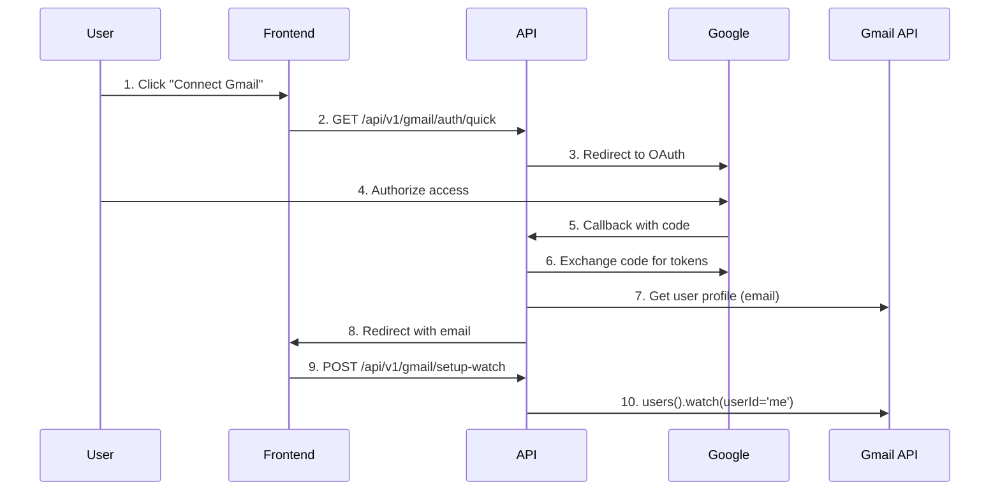

# Gmail Email Watching - How It Works and Setup Guide

## 🎯 Quick Answer

**NO**, the system does **NOT** automatically detect email addresses from your Google credentials. You **MUST** explicitly specify which email address to watch.

## 📋 Current Docker Status

Based on your current containers:
- ✅ **Running**: `revracoon-backend_db_1` (postgres:16-alpine on port 5432)
- ✅ **Running**: `revracoon-backend_redis_1` (redis:7-alpine on port 6379)
- ❌ **Stopped**: Several AP Intake containers from previous attempts

## 🔍 How Gmail Watching Works in This System

### 1. Email Address Detection
The system **requires explicit email address specification** through:

```python
# From gmail_webhook.py - Line 133
email = body['email']  # MUST be provided in request

# From gmail_pubsub_service.py - Line 365
email = credentials_data.get('email')  # Retrieved from credentials
```

### 2. Gmail API `userId` Parameter
The system uses `userId='me'` in Gmail API calls, which means:
- `me` = The currently authenticated user
- The email address is determined during OAuth flow
- **NOT** automatically extracted from credentials

### 3. OAuth Flow Process


## 🚀 Manual Testing Setup

### Step 1: Start Core Services Only
```bash
# Start only essential services
docker-compose -f docker-compose.simple.yml up -d

# Check services are running
docker ps
```

### Step 2: Build and Start API
```bash
# Build API with cache
docker-compose -f docker-compose.test.yml build api

# Start API service
docker-compose -f docker-compose.test.yml up -d api
```

### Step 3: Configure Gmail OAuth
Edit your `.env.test` file:
```bash
# Replace with your actual Gmail OAuth credentials
GMAIL_CLIENT_ID=your-actual-client-id.apps.googleusercontent.com
GMAIL_CLIENT_SECRET=your-actual-client-secret
GCP_PROJECT_ID=your-gcp-project-id
```

### Step 4: Authorize Gmail Account
```bash
# 1. Initiate OAuth flow
curl "http://localhost:8001/api/v1/gmail/auth/quick?user_id=test_user&redirect_to=http://localhost:3001/dashboard"

# 2. This will redirect you to Google OAuth
# 3. After authorization, Google redirects back with email address
# 4. The email address is extracted from the OAuth callback
```

### Step 5: Set Up Email Watching
```bash
# After OAuth is complete, set up watch for specific email
curl -X POST "http://localhost:8001/api/v1/gmail/setup-watch" \
  -H "Content-Type: application/json" \
  -d '{
    "email": "your-email@gmail.com",
    "credentials": {
      "client_id": "your-client-id",
      "client_secret": "your-client-secret",
      "token": "oauth-token",
      "refresh_token": "refresh-token"
    }
  }'
```

## 🔧 API Endpoints for Email Management

### 1. Quick OAuth Authorization
```bash
GET /api/v1/gmail/auth/quick?user_id={user_id}&redirect_to={url}
```
- **Purpose**: Generate OAuth URL and redirect to Google
- **Returns**: Redirect to Google OAuth
- **Email**: Determined after OAuth callback

### 2. OAuth Callback
```bash
GET /api/v1/gmail/oauth/callback?code={code}&state={state}
```
- **Purpose**: Handle Google OAuth callback
- **Process**: 
  1. Exchange code for tokens
  2. Get user profile (email address)
  3. Redirect back with email info
- **Email**: Extracted from `users().getProfile(userId='me')`

### 3. Setup Email Watch
```bash
POST /api/v1/gmail/setup-watch
```
- **Purpose**: Start monitoring specific email inbox
- **Required**: `email` field MUST be provided
- **Process**: Calls `gmail.users().watch(userId='me')`

### 4. Check Watch Status
```bash
GET /api/v1/gmail/watch/status
```
- **Purpose**: Check if email monitoring is active
- **Returns**: Watch expiry and health status

## 📊 How to Monitor Which Emails Are Being Watched

### 1. Check Active Watches
```bash
# Check current watch status
curl "http://localhost:8001/api/v1/gmail/watch/health"

# Check Gmail stats
curl "http://localhost:8001/api/v1/gmail/stats"
```

### 2. Database Query (When Implemented)
The system has a TODO for database storage:
```python
# From gmail_pubsub_service.py - Line 391
# TODO: Implement user credential retrieval from database
# For now, return None - this would be implemented based on your auth system
return None
```

### 3. Log Monitoring
```bash
# Check API logs for email processing
docker-compose -f docker-compose.test.yml logs -f api

# Look for these log messages:
# "Setting up Gmail watch for {email}"
# "Successfully authenticated Gmail user: {email_address}"
# "Processing Gmail notification for {email_address}"
```

## 🎛️ Testing Workflow

### 1. Test with Specific Email
```bash
# 1. Start services
./test-gmail-setup.sh --setup

# 2. Authorize your Gmail account
open "http://localhost:8001/api/v1/gmail/auth/quick?user_id=test&redirect_to=http://localhost:3001"

# 3. After OAuth, setup watch for your email
curl -X POST "http://localhost:8001/api/v1/gmail/setup-watch" \
  -H "Content-Type: application/json" \
  -d '{"email": "your-actual-email@gmail.com"}'

# 4. Send test email with invoice PDF
# Send from any email to your-actual-email@gmail.com
# Subject should contain "invoice" keyword
# Attach a PDF file

# 5. Monitor processing
docker-compose -f docker-compose.test.yml logs -f api worker
```

### 2. Verify Email Processing
```bash
# Check if email was processed
curl "http://localhost:8001/api/v1/gmail/stats"

# Look for:
# - "total_emails_processed" > 0
# - "invoices_detected" > 0
# - "attachments_processed" > 0
```

## 🔍 Key Findings

### 1. Email Address Sources
The system gets email addresses from:
- **OAuth Callback**: `users().getProfile(userId='me')` after authorization
- **Manual Setup**: Explicit `email` parameter in `/setup-watch` endpoint
- **Database**: Future implementation (currently TODO)

### 2. No Automatic Detection
The system **CANNOT** automatically extract email from:
- Google Client ID
- Google Client Secret
- OAuth tokens
- Service account credentials

### 3. Required Manual Specification
You **MUST** provide the email address:
- During OAuth setup (automatic from profile)
- During watch setup (manual API call)
- For each email you want to monitor

## 🚨 Important Notes

### 1. One Email Per OAuth Flow
- Each OAuth authorization gets ONE email address
- To monitor multiple emails, repeat OAuth flow for each
- Each email needs separate watch setup

### 2. Watch Expiry
- Gmail watches expire after 7 days
- System should auto-renew (not fully implemented)
- Manual renewal may be required

### 3. Permissions Required
- Gmail API scopes: `https://www.googleapis.com/auth/gmail.readonly`
- Google Cloud Pub/Sub for real-time notifications
- User must explicitly grant access

## 📝 Summary

| Question | Answer |
|----------|--------|
| **Auto-detect email from credentials?** | ❌ NO |
| **Need to specify email manually?** | ✅ YES |
| **How to specify?** | OAuth flow OR `/setup-watch` API |
| **Where to check active emails?** | `/gmail/stats` or logs |
| **Can monitor multiple emails?** | ✅ Yes, but separate setup per email |

The system requires **explicit email address specification** through the OAuth authorization flow or manual API calls. It does **not** automatically extract email addresses from Google OAuth credentials.