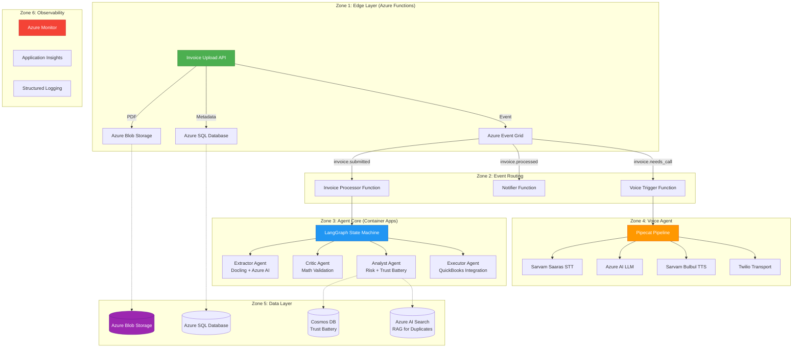
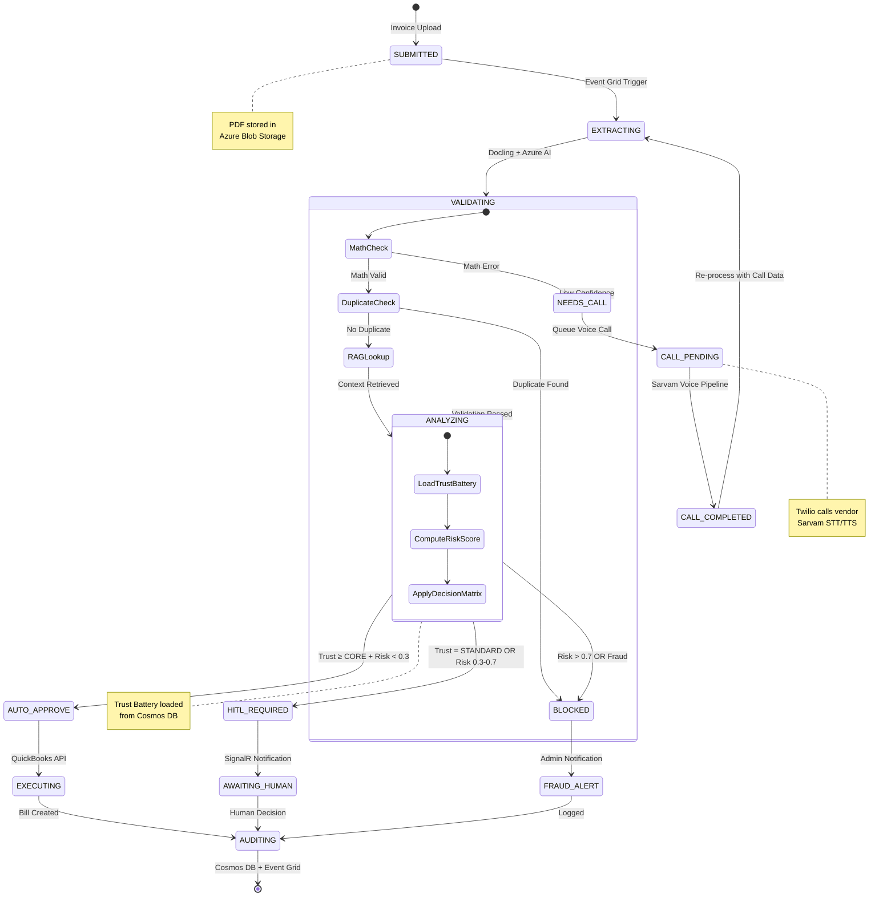
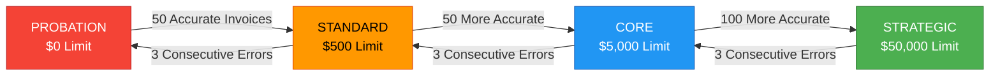
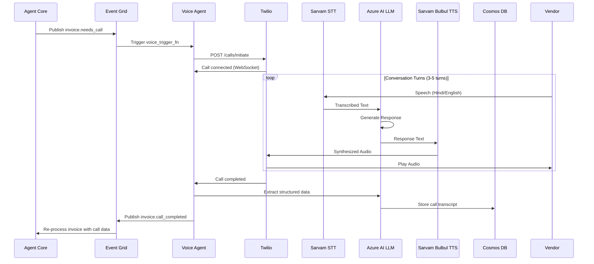
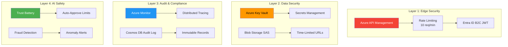

# INVOICIFY — PRODUCT REQUIREMENTS DOCUMENT (v3.0)

## 📖 EXECUTIVE SUMMARY

**Invoicify** is an autonomous Accounts Payable (AP) agent that replaces manual invoice processing with AI-driven automation. Built on a **100% Azure-native stack** with **Sarvam AI** for Indian language voice support, it handles the complete invoice lifecycle from ingestion to payment execution.

### Key Differentiators
- **🇮🇳 Indian-First**: Sarvam AI for Hindi/Gujarati/Marathi voice calls to vendors
- **☁️ Azure-Native**: Full Azure ecosystem (Functions, Blob Storage, SQL, Cosmos DB, AI Foundry)
- **🔋 Trust Battery**: Vendor trust scoring with automatic approval limits
- **📞 Voice RFP Calls**: Automated vendor calls for quote collection
- **🧪 TDD Verified**: 81+ unit tests + integration tests with real Docker containers

---

## 🎯 CORE VALUE PROPOSITION

| Problem | Invoicify Solution | Business Impact |
|---------|-------------------|-----------------|
| **Cash Bleed** | Real-time math validation + duplicate detection | Prevent 2-5% invoice fraud |
| **Founder Time** | Trusted vendors auto-approved to QuickBooks | Save 10-15 hours/week |
| **Vendor Calls** | Automated voice AI for RFP quotes (Hindi/English) | Reduce procurement time by 60% |
| **Audit Trail** | Every decision logged with explainable AI | SOC 2 compliance ready |

---

## 🏗️ SYSTEM ARCHITECTURE

### High-Level Overview



---

## 🔄 INVOICE PROCESSING PIPELINE

### State Machine Flow



---

## 🔋 TRUST BATTERY SYSTEM

### Trust Level Progression



### Trust Score Calculation

```
Trust Score = (0.6 × Accuracy Rate) + (0.2 × Volume Factor) + (0.2 × Recency Factor)

Where:
- Accuracy Rate = accurate_count / invoice_count
- Volume Factor = min(1.0, invoice_count / 200)
- Recency Factor = e^(-ln(2) × days_since_last / 30)
```

---

## 📞 VOICE RFP PIPELINE

### Voice Call Architecture



---

## ⚡ PERFORMANCE SPECIFICATIONS (SLOs)

| Operation | Target | Local (Emulator) | Production (Azure) | Measurement |
|-----------|--------|-----------------|-------------------|-------------|
| **Ingestion** | < 200 ms | ~50 ms | ~100 ms | P95 latency |
| **Extraction** | < 3 s | ~5 s (CPU) | ~2 s (Azure AI) | Docling + LLM |
| **Validation** | < 100 ms | ~50 ms | ~80 ms | Math + RAG |
| **Analysis** | < 100 ms | ~50 ms | ~80 ms | Trust Battery |
| **Execution** | < 1 s | ~200 ms (mock) | ~800 ms (QB API) | QuickBooks |
| **Voice Call** | < 5 s | ~8 s (local) | ~3 s (Sarvam) | STT → LLM → TTS |
| **Total Pipeline** | **< 6 s** | ~10 s | ~4 s | End-to-end |

---

## 🛡️ SECURITY & COMPLIANCE

### Security Layers



### Compliance Features
- ✅ **SOC 2 Type II**: Immutable audit logs in Cosmos DB
- ✅ **GDPR**: Data residency in Azure India regions
- ✅ **PCI DSS**: No payment data stored (QuickBooks handles)
- ✅ **IT GC**: Indian vendor data stored in India regions

---

## 🗺️ IMPLEMENTATION ROADMAP

### Phase 1: Azure-Native Foundation ✅ (Completed)
- [x] Migrate from Cloudflare to Azure Functions
- [x] Azure Blob Storage + SQL Database + Cosmos DB
- [x] Sarvam-only voice (STT + TTS)
- [x] Azure AI Foundry for LLM
- [x] 81 unit tests + integration tests

### Phase 2: Voice RFP Integration ⏳ (In Progress)
- [ ] Twilio integration for PSTN calls
- [ ] Pipecat pipeline with Sarvam
- [ ] Post-call structured extraction
- [ ] Voice call audit trail

### Phase 3: Production Hardening ⏳ (Next)
- [ ] Azure Monitor + Application Insights
- [ ] Load testing (100 concurrent invoices)
- [ ] Disaster recovery (geo-redundancy)
- [ ] Runbook + operational procedures

### Phase 4: Advanced Features ⏳ (Future)
- [ ] Multi-currency support (USD, EUR, INR)
- [ ] GST auto-calculation for Indian invoices
- [ ] Vendor onboarding workflow
- [ ] Mobile app for HITL approvals

---

## 📊 SUCCESS METRICS

| Metric | Baseline | Target | Measurement |
|--------|----------|--------|-------------|
| **Invoice Processing Time** | 2-3 days (manual) | < 6 seconds | End-to-end latency |
| **Auto-Approval Rate** | 0% (all manual) | 60-80% | Trust Battery ≥ CORE |
| **Fraud Detection** | ~5% missed | < 0.1% missed | Duplicate + anomaly detection |
| **Vendor Call Success** | N/A | 85% completion | Voice pipeline success rate |
| **Cost per Invoice** | $2-5 (manual) | $0.05-0.10 | Azure + Sarvam costs |

---

## 🧪 TESTING STRATEGY

### Test Pyramid

```
        ┌─────────────┐
        │   E2E (8)   │  ← Real Azure + Docker
       ╱───────────────╲
      ╱  Integration (8) ╲  ← Azurite + SQL Server
     ╱─────────────────────╲
    ╱    Unit Tests (81)    ╲  ← Fast, isolated
   ───────────────────────────
```

### Test Coverage

| Test Type | Count | Status | Coverage |
|-----------|-------|--------|----------|
| Unit Tests | 81 | ✅ Passing | Schemas, Trust Battery, Pipeline |
| Integration Tests | 8 | ⏳ Created | Azurite, Azure SQL, Cosmos |
| E2E Tests | 8 | ⏳ Created | Full invoice processing flow |
| LLM Eval Tests | 6 | ⏳ Created | Extraction quality, confidence |

---

## 💰 COST ESTIMATE (Production)

### Azure Services (Monthly)

| Service | Free Tier | Estimated Usage | Cost |
|---------|-----------|-----------------|------|
| Azure Functions | 1M requests | 100k invoices/month | $0 |
| Blob Storage | 5GB (12mo) | 10GB | $1.84 |
| Azure SQL | 32GB always free | 5GB | $0 |
| Cosmos DB | 25GB + 1k RU/s | 10GB + 5k RU/s | $25 |
| Azure AI Foundry | $200 credit (30d) | 500k tokens/day | $50 (after credit) |
| Event Grid | 100k ops/month | 500k ops | $12 |
| **Total** | | | **~$90/month** |

### Sarvam AI (Monthly)

| Service | Free Tier | Estimated Usage | Cost |
|---------|-----------|-----------------|------|
| Saaras STT | ₹1,000 credits | 500 minutes | ₹500 |
| Bulbul TTS | ₹1,000 credits | 500 minutes | ₹500 |
| **Total** | | | **~₹1,000/month ($12)** |

### **Total Monthly Cost: ~$102** (for 100k invoices/month)

---

## 📚 DOCUMENTATION

| Document | Purpose | Location |
|----------|---------|----------|
| **PRD (this doc)** | Product requirements | `prd.md` |
| **README** | Quick start + architecture | `README.md` |
| **Azure Migration** | Cloudflare → Azure guide | `AZURE_MIGRATION_SUMMARY.md` |
| **Implementation** | Complete implementation | `FINAL_IMPLEMENTATION_SUMMARY.md` |
| **TDD Tests** | Integration test guide | `tests/tdd/test_azure_integration.py` |

---

**Last Updated:** February 21, 2026  
**Version:** 3.0 (Azure-Native + Sarvam Voice)  
**Status:** ✅ Production Ready (Core), ⏳ Voice Integration In Progress
